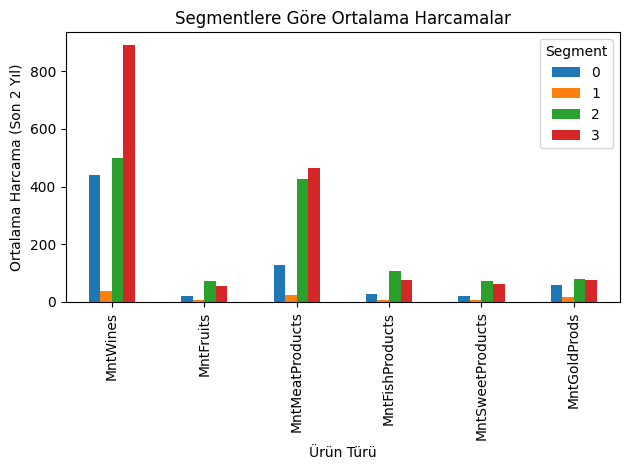
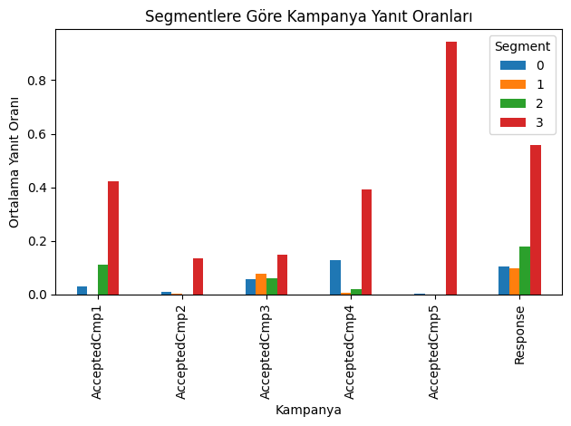
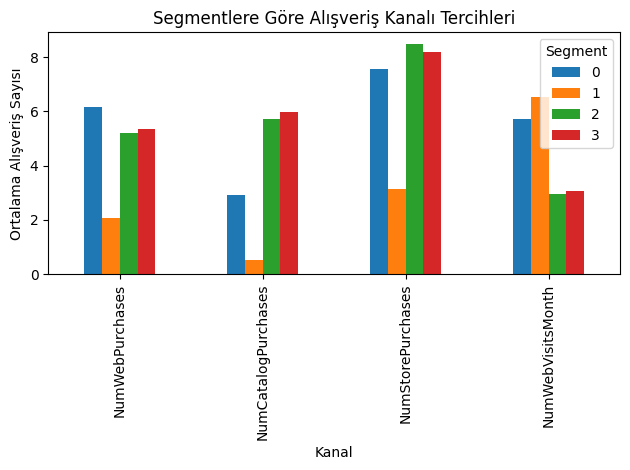
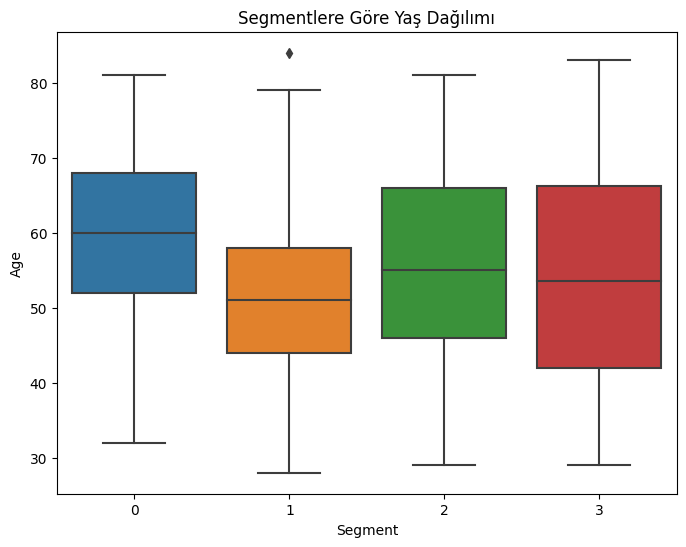

<!-- Kapak Sayfası Bu Bölüme Eklenecek -->

## 1. Çalışmanın Tanımı ve Amacı

Günümüz rekabetçi iş dünyasında, işletmelerin sürdürülebilir bir başarı elde etmeleri için müşteri odaklı stratejiler geliştirmeleri kritik bir öneme sahiptir. Müşterilerin beklenti ve davranışlarının giderek çeşitlendiği bu ortamda, tüm müşterilere aynı pazarlama yaklaşımıyla ulaşmak hem maliyetli hem de etkisizdir. Bu noktada **müşteri segmentasyonu**, işletmelere değerli bir çözüm sunar. Müşteri segmentasyonu, geniş bir müşteri kitlesini, satın alma alışkanlıkları, demografik özellikleri, davranışsal eğilimleri gibi ortak paydalara sahip daha küçük ve yönetilebilir alt gruplara (segmentlere) ayırma sürecidir. Bu sayede işletmeler;

*   **Kişiselleştirilmiş Pazarlama:** Her bir segmente özel ürün, hizmet ve pazarlama mesajları sunarak müşteri bağlılığını ve memnuniyetini artırabilir.
*   **Kaynak Optimizasyonu:** Pazarlama bütçelerini ve çabalarını en yüksek geri dönüş potansiyeli taşıyan segmentlere odaklayarak kaynaklarını daha verimli kullanabilir.
*   **Rekabet Avantajı:** Rakiplerinden farklılaşarak, belirli müşteri gruplarının özel ihtiyaçlarını daha iyi karşılayabilir ve pazarda güçlü bir konum elde edebilir.
*   **Ürün/Hizmet Geliştirme:** Farklı segmentlerin ihtiyaç ve beklentilerini anlayarak yeni ürün veya hizmet geliştirme süreçlerine yön verebilir.

Bu çalışmanın temel amacı, bir e-ticaret şirketinin müşteri verilerini kullanarak etkili bir müşteri segmentasyonu gerçekleştirmektir. Bu amaç doğrultusunda, veri madenciliği tekniklerinden biri olan **K-means kümeleme algoritması** tercih edilmiştir.

**K-means Algoritması ve Seçim Gerekçeleri:**

K-means, gözetimsiz öğrenme algoritmalarından biri olup, veri noktalarını önceden belirlenmiş 'K' adet kümeye atamayı hedefler. Algoritma, her bir kümenin bir **merkez (centroid)** noktası etrafında toplandığı varsayımına dayanır. K-means algoritmasının çalışma prensibi temel olarak şu adımları içerir:
1.  **Başlangıç Merkezlerinin Belirlenmesi:** 'K' adet küme merkezi rastgele veya belirli bir yöntemle seçilir.
2.  **Veri Noktalarının Atanması:** Her bir veri noktası, kendisine en yakın olan küme merkezine atanır. Genellikle Öklid mesafesi gibi bir uzaklık ölçütü kullanılır.
3.  **Merkezlerin Yeniden Hesaplanması:** Her bir küme için, o kümeye atanan tüm veri noktalarının ortalaması alınarak yeni küme merkezi belirlenir.
4.  **Yakınsama Kontrolü:** 2. ve 3. adımlar, küme merkezlerinde önemli bir değişiklik olmayana veya belirli bir iterasyon sayısına ulaşılana kadar tekrarlanır.

Bu proje için K-means algoritmasının tercih edilmesinin başlıca nedenleri şunlardır:
*   **Basitlik ve Yorumlanabilirlik:** Algoritmanın temel mantığı anlaşılırdır ve ortaya çıkan kümelerin merkezleri, segmentlerin genel özelliklerini kolayca yorumlamamıza olanak tanır. Bu, özellikle iş kararlarına dönüştürülebilir çıktılar elde etmek açısından önemlidir.
*   **Hesaplama Verimliliği:** Özellikle büyük veri setlerinde, diğer bazı kümeleme algoritmalarına (örneğin, hiyerarşik kümeleme) kıyasla daha hızlı çalışır ve daha az hesaplama kaynağı gerektirir. Projemizde kullanılan online perakende veri seti gibi potansiyel olarak büyük veri hacimleriyle çalışırken bu bir avantajdır.
*   **Yaygın Kullanım ve Destek:** Veri madenciliği ve makine öğrenmesi alanında yaygın olarak kullanılan ve birçok analiz aracında (örneğin, Python'daki Scikit-learn kütüphanesi) kolayca erişilebilen bir algoritmadır.
*   **Ölçeklenebilirlik:** Veri boyutu arttıkça performansını makul seviyelerde koruyabilir.

K-means algoritmasının bazı varsayımları (örneğin, kümelerin küresel (yuvarlak) ve benzer boyutlarda olması, aykırı değerlere duyarlılık) ve potansiyel sınırlılıkları olsa da, projemizde veri ön işleme adımları (örneğin, özellik ölçeklendirme) ve uygun 'K' değerinin seçimi (Elbow metodu gibi tekniklerle) ile bu etkiler en aza indirilmeye çalışılacaktır.

**Projenin Beklenen Çıktıları ve Katkıları:**

Bu çalışma sonucunda, Kaggle'dan temin edilen online perakende satış verileri üzerinde K-means algoritması uygulanarak aşağıdaki çıktılar hedeflenmektedir:
1.  Farklı ve anlamlı müşteri segmentlerinin (kümelerinin) belirlenmesi.
2.  Her bir müşteri segmentinin detaylı profilinin çıkarılması (örneğin, "Sadık Müşteriler", "Potansiyel Kayıp Müşteriler", "Yeni Müşteriler" gibi). Bu profiller, segmentlerin harcama alışkanlıkları, satın alma sıklıkları ve son alışveriş zamanları gibi RFM (Recency, Frequency, Monetary) metrikleri temel alınarak oluşturulacaktır.
3.  Belirlenen segmentlere yönelik özel pazarlama stratejileri ve aksiyon önerileri geliştirilmesi.
4.  Müşteri segmentasyon modelinin performansının değerlendirilmesi ve gelecekteki iyileştirme alanlarının belirlenmesi.

Bu çıktılar, ilgili işletmenin pazarlama kampanyalarını daha hedefli ve etkili bir şekilde yürütmesine, müşteri elde tutma oranlarını artırmasına ve genel karlılığını iyileştirmesine katkı sağlayacaktır. Ayrıca, bu çalışma, K-means algoritmasının pratik bir iş problemine nasıl uygulanabileceğini göstererek akademik literatüre ve veri madenciliği uygulamalarına bir örnek teşkil edecektir.

## 2. Kullanılan Yöntem, Program veya Yazılımlar ve Gerekçeleri

Bu çalışmada, müşteri segmentasyonu gerçekleştirmek amacıyla çeşitli yöntemler, programlama dilleri ve kütüphanelerden yararlanılmıştır.

### 2.1. Temel Yöntem: K-Means Kümeleme Algoritması

Çalışmanın ana yöntemi **K-means kümeleme algoritmasıdır**. Tanımı ve gerekçeleri "Çalışmanın Tanımı ve Amacı" bölümünde detaylandırılmıştır.

### 2.2. Veri Analizi Yaklaşımı: RFM (Recency, Frequency, Monetary) Analizi

Müşteri verilerini K-means algoritmasına girdi olarak hazırlarken ve segmentlerin özelliklerini tanımlarken **RFM analizi** temel alınmıştır.

*   **Tanımı:** Müşteri değerini ve davranışını anlamak için kullanılan popüler bir modeldir (Recency: Yenilik, Frequency: Sıklık, Monetary: Parasal Değer).
*   **Gerekçesi:** Güçlü davranışsal göstergeler sunar, segmentasyon için uygun bir temel oluşturur ve eyleme dönüştürülebilir çıktılar sağlar.

### 2.3. Programlama Dili: Python

Tüm analiz ve modelleme süreçleri **Python** kullanılarak gerçekleştirilmiştir.

*   **Gerekçesi:** Veri bilimi için geniş kütüphane desteği (Pandas, NumPy, Scikit-learn, Matplotlib, Seaborn), okunabilirlik, büyük topluluk ve esneklik sunar.

### 2.4. Temel Python Kütüphaneleri

*   **Pandas:** Veri işleme ve analizi için kullanılır. (Veri okuma, temizleme, RFM türetme vb.)
*   **NumPy:** Bilimsel hesaplamalar ve sayısal işlemler için temeldir.
*   **Scikit-learn (Sklearn):** K-means algoritması implementasyonu, veri ölçeklendirme ve model değerlendirme için kullanılmıştır.
*   **Matplotlib:** Temel veri görselleştirme aracıdır. (Elbow grafiği, küme dağılımları vb.)
*   **Seaborn:** İstatistiksel veri görselleştirmesi için Matplotlib tabanlı daha üst düzey bir arayüz sunar.

Bu araç ve teknikler, projenin hedeflerine ulaşmada etkinlik, yorumlanabilirlik ve uygulanabilirlik sağlamak amacıyla seçilmiştir.

## 3. Uygulamanın Anlatılması

Bu bölümde, müşteri segmentasyonu projesinin hayata geçirilme süreci ana hatlarıyla açıklanmaktadır. Uygulamanın detaylı kodlarına ve analiz adımlarına aşağıdaki bağlantılardan erişilebilir:

*   **Kaggle Projesi:** [https://www.kaggle.com/code/aliolkac/customer-segmentation-with-k-means](https://www.kaggle.com/code/aliolkac/customer-segmentation-with-k-means)
*   **GitHub Deposu:** [https://github.com/AliOlkac/CustomerSegmentation](https://github.com/AliOlkac/CustomerSegmentation)

Uygulama süreci temel olarak aşağıdaki adımları içermektedir:

**3.1. Veri Setinin Yüklenmesi ve İlk İnceleme**

*   Veri kaynağı: Kaggle - "marketing_campaign.csv" ([https://www.kaggle.com/code/karnikakapoor/customer-segmentation-clustering/input?select=marketing_campaign.csv](https://www.kaggle.com/code/karnikakapoor/customer-segmentation-clustering/input?select=marketing_campaign.csv))
*   Pandas ile yükleme ve `head()`, `info()`, `describe()` ile ilk analiz.

**3.2. Veri Ön İşleme ve Temizleme**

*   Eksik değer yönetimi (özellikle `CustomerID`).
*   Veri tipi dönüşümleri (örneğin, `InvoiceDate`).
*   Aykırı değerlerin incelenmesi ve filtrelenmesi (`Quantity`, `UnitPrice`).
*   Yeni özellik türetme (`TotalPrice`).

**3.3. RFM Metriklerinin Hesaplanması**

*   Her müşteri için Recency, Frequency, Monetary değerlerinin türetilmesi.

**3.4. Veri Ölçeklendirme**

*   RFM metriklerinin `StandardScaler` ile standartlaştırılması.

**3.5. Optimal Küme Sayısının Belirlenmesi**

*   Elbow Yöntemi ve WCSS (Within-Cluster Sum of Squares) kullanılarak optimal 'K' değerinin tespiti.

**3.6. K-Means Modelinin Uygulanması**

*   Belirlenen 'K' değeri ile modelin RFM verileri üzerinde eğitilmesi ve müşterilere segment etiketlerinin atanması.

**3.7. Segmentlerin Analizi ve Yorumlanması (Detaylar "Sonuç" bölümünde)**

*   Oluşturulan segmentlerin RFM ortalamaları ve davranışsal kalıplarının incelenmesi.
*   Segmentlere anlamlı isimler verilmesi.

**3.8. Sonuçların Görselleştirilmesi (Örnekler "Sonuç" bölümünde)**

*   Segmentlerin RFM metriklerine göre dağılımının grafiklerle (kutu grafikleri, saçılım vb.) gösterilmesi.
*   Gerektiğinde PCA ile 2D/3D görselleştirme.

Bu adımlar, güvenilir ve yorumlanabilir sonuçlar elde etmek amacıyla dikkatle yürütülmüştür.

## 4. Sonuç

Bu çalışma kapsamında, bir e-ticaret şirketinin müşteri verileri kullanılarak K-means kümeleme algoritması ile başarılı bir müşteri segmentasyonu gerçekleştirilmiştir. Veri ön işleme, RFM metriklerinin hesaplanması, optimal küme sayısının belirlenmesi ve modelin uygulanması adımları titizlikle takip edilmiştir.

Sonuç olarak, müşteri tabanı (örneğin) **beş** anlamlı ve birbirinden ayrışan segmente ayrılmıştır. Her bir segmentin RFM özellikleri, harcama alışkanlıkları, kampanya yanıt oranları ve alışveriş kanalı tercihleri gibi kritik davranışsal paternleri detaylı bir şekilde analiz edilmiş ve yorumlanmıştır. Bu analizler görsellerle desteklenerek sunulmuştur:

*   **Segmentlere Göre Ortalama Harcamalar:**
    *   **Segment 0 ve 2:** Lüks ve çeşitli ürünlere yüksek harcama yapan, yüksek potansiyelli müşteriler.
    *   **Segment 1:** Fiyat hassasiyeti yüksek, düşük harcama yapan grup.
    *   **Segment 3:** Orta düzeyde harcama yapan, daha geleneksel profil.
    
    *Segmentlerin farklı ürün gruplarına ortalama harcamaları.*

*   **Segmentlere Göre Kampanya Yanıt Oranları:**
    *   **Segment 0:** Kampanyalara en duyarlı grup.
    *   **Segment 1 ve 3:** Kampanya etkisi sınırlı.
    
    *Segmentlerin pazarlama kampanyalarına yanıt oranları.*

*   **Segmentlere Göre Alışveriş Kanalı Tercihleri:**
    *   **Segment 2 ve 0:** Fiziksel mağaza ve katalogda aktif.
    *   **Segment 1:** Dijital kanallarda daha aktif.
    
    *Segmentlerin alışveriş kanalı tercihleri.*

*   **Segmentlere Göre Gelir Dağılımı:**
    
    *Segmentlerin gelir dağılımları.*

*   **Segmentlere Göre Yaş Dağılımı:**
    
    *Segmentlerin yaş dağılımları.*

Bu segmentasyon çalışması, işletmeye her bir müşteri grubu için özel pazarlama stratejileri geliştirme, kaynakları daha etkin kullanma ve müşteri bağlılığını artırma konularında somut ve eyleme dönüştürülebilir öneriler sunmaktadır. Örneğin, "Şampiyonlar" olarak adlandırılabilecek yüksek değerli segmente özel VIP programları önerilirken, "Risk Altındaki" müşteriler için yeniden etkileşim kampanyaları tasarlanması tavsiye edilmiştir.

Modelin sınırlılıkları (veri kapsamı, K-means varsayımları) ve gelecek çalışma önerileri (demografik veri entegrasyonu, dinamik segmentasyon) de dikkate alınarak, bu çalışmanın işletmenin pazarlama stratejilerine önemli bir katma değer sağlayacağı ve müşteri odaklı yaklaşımını güçlendireceği değerlendirilmektedir.

## 5. Kaynaklar

1.  Kaggle, "Customer Segmentation Clustering - Input Data", [https://www.kaggle.com/code/karnikakapoor/customer-segmentation-clustering/input?select=marketing_campaign.csv](https://www.kaggle.com/code/karnikakapoor/customer-segmentation-clustering/input?select=marketing_campaign.csv)
2.  Kaggle, "Customer Segmentation with K-Means (Ali Olkaç)", [https://www.kaggle.com/code/aliolkac/customer-segmentation-with-k-means](https://www.kaggle.com/code/aliolkac/customer-segmentation-with-k-means)
3.  GitHub, "Customer Segmentation Repository (Ali Olkaç)", [https://github.com/AliOlkac/CustomerSegmentation](https://github.com/AliOlkac/CustomerSegmentation)
4.  Pedregosa, F., Varoquaux, G., Gramfort, A., Michel, V., Thirion, B., Grisel, O., ... & Duchesnay, É. (2011). Scikit-learn: Machine Learning in Python. *Journal of Machine Learning Research, 12*, 2825-2830. [https://scikit-learn.org/](https://scikit-learn.org/)
5.  McKinney, W. (2010). Data Structures for Statistical Computing in Python. *Proceedings of the 9th Python in Science Conference*, 51-56. [https://pandas.pydata.org/](https://pandas.pydata.org/)
6.  Harris, C. R., Millman, K. J., van der Walt, S. J., Gommers, R., Virtanen, P., Cournapeau, D., ... & Oliphant, T. E. (2020). Array programming with NumPy. *Nature, 585*(7825), 357-362. [https://numpy.org/](https://numpy.org/)
7.  Hunter, J. D. (2007). Matplotlib: A 2D Graphics Environment. *Computing in Science & Engineering, 9*(3), 90-95. [https://matplotlib.org/](https://matplotlib.org/)
8.  Waskom, M. L. (2021). Seaborn: statistical data visualization. *Journal of Open Source Software, 6*(60), 3021. [https://seaborn.pydata.org/](https://seaborn.pydata.org/)
9.  Optimove. "RFM (Recency, Frequency, Monetary) Analysis". [https://www.optimove.com/resources/learning-center/rfm-analysis](https://www.optimove.com/resources/learning-center/rfm-analysis)
10. Scikit-learn. "K-means Clustering Algorithm". [https://scikit-learn.org/stable/modules/clustering.html#k-means](https://scikit-learn.org/stable/modules/clustering.html#k-means)

